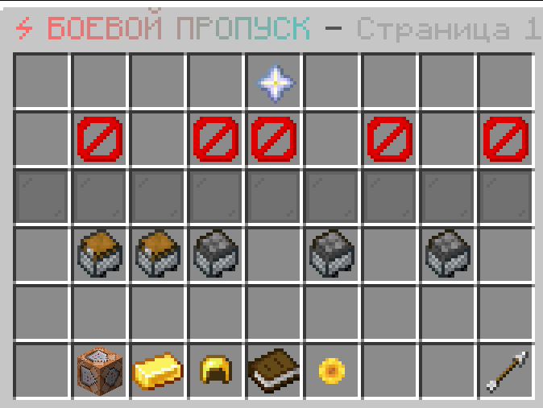
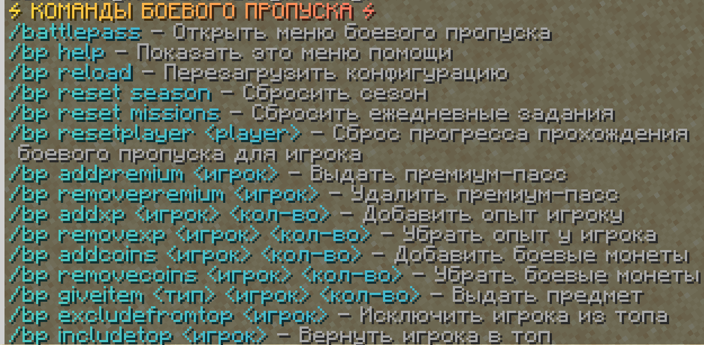

# ⚔️ BattlePass - Ultimate Progression Plugin for Minecraft (1.21.10)

> **The most advanced, feature-rich Battle Pass system for Paper servers.**
> Engage your players with Daily Missions, Tiered Rewards, and a custom Currency Shop.
> **No config editing required** — manage everything via In-Game GUI!

 

## 🚨 Important Disclaimer

This is a **fork** of the original BattlePass plugin by [lino9999](https://github.com/lino9999/BattlePass).

### 📋 Modifications from Original
This fork includes the following enhancements:
- **Expanded mission functionality** with additional features and mission types
- Various improvements and customizations beyond the original codebase

## 🌟 Why Choose BattlePass-Fork?
Unlike other plugins, **BattlePass-Fork** focuses on ease of use for admins and engagement for players. It includes a powerful **In-Game Editor**, robust **MySQL Database** support for networks, and deep integrations with popular plugins like **MythicMobs**.

### 🔥 Key Features

* **🏆 Seasonal Progression System**
    * Fully customizable tier system (default 54 levels).
    * **Dual Reward Tracks**: Free Pass (for everyone) and Premium Pass (VIP/Paid).
    * Automatic season reset options (Monthly or Duration-based).

* **🛠️ In-Game GUI Editor (No YAML needed!)**
    * **Mission Editor**: Create, edit, or delete daily missions directly inside the game.
    * **Rewards Editor**: Drag-and-drop items from your inventory to set rewards for any level.

* **💾 Database & Sync Support**
    * **SQLite** (Default): Plug and play for single servers.
    * **MySQL**: Full support for syncing player progress, XP, and rewards across a BungeeCord/Velocity network.

* **📜 Dynamic Missions** *(Enhanced in this fork)*
    * **7 Daily Missions** generated randomly every day.
    * **Extended Mission Types** with additional targets and parameters:
        - Kill specific mob types with `additional-targets` support
        - Trade with specific villager professions
        - Enchant multiple item types
        - Deal/take damage from specific sources
        - Track specific types of player movement
        - And more!

* **💰 Battle Coins & Shop**
    * Players earn **Battle Coins** by ranking in the daily leaderboard.
    * Spend coins in the customizable **Shop GUI** for exclusive items, XP boosts, or commands.

* **🔌 Powerful Integrations**
    * **PlaceholderAPI**: Full support for scoreboards, tabs, and chat.
    * **MythicMobs**: Create missions to kill specific custom bosses or mobs.

## 🆕 New Features & Improvements in this Fork

### 1. **Extended Target Support for Missions**
This allows tasks to be more generic and flexible with `additional-targets` parameter:

```yaml
kill-skeletons:
  type: KILL_MOB
  target: SKELETON
  additional-targets:
    - STRAY
    - BOGGED
  display-name: "Kill <amount> Skeletons"
  min-required: 10
  max-required: 25
  min-xp: 100
  max-xp: 200
  weight: 10
```

### 2. **Specific Villager Profession Trading**
Supported targets: `ANY`, `FARMER`, `FISHERMAN`, `SHEPHERD`, `FLETCHER`, `LIBRARIAN`, `CARTOGRAPHER`, `CLERIC`, `ARMORER`, `WEAPONSMITH`, `TOOLSMITH`, `BUTCHER`, `LEATHERWORKER`, `MASON`, `MERCHANT`.

### 3. **Multi-Item Type Enchanting Support**
Example:

```yaml
enchant-swords:
  type: ENCHANT_ITEM
  target: DIAMOND_SWORD
  additional-targets:
    - "NETHERITE_SWORD"
    - "IRON_SWORD"
    - "GOLDEN_SWORD"
    - "COPPER_SWORD"
    - "STONE_SWORD"
    - "WOODEN_SWORD"
  display-name: "Enchant <amount> swords"
  min-required: 1
  max-required: 3
  min-xp: 150
  max-xp: 300
  weight: 5
```

### 4. **Enhanced Damage Tracking**
- **Damage Dealt** to specific mob groups
- **Damage Taken** from specific sources (FIRE, LAVA, FALL, etc.)
- **Death Tracking** from specific causes

### 5. **Specific Movement Type Tracking**
Supported targets: `ANY`, `WALK`, `SWIM`, `FLY`, `SNEAK`.

### 6. **Extended Mission Parameters**
- Flexible damage amount requirements
- Multiple mob/entity targeting
- Profession-specific villager interactions


## 📥 Installation

1.  Download `BattlePass-Fork.jar`.
2.  Drop it into your server's `/plugins/` folder.
3.  (Optional) Install **PlaceholderAPI** for placeholders.
4.  Restart your server.
5.  Enjoy! Config files (`config.yml`, `missions.yml`, `shop.yml`) will generate automatically.

## 🎮 Commands & Permissions

| Command                                 | Permission         | Description                                             |
|:----------------------------------------|:-------------------|:--------------------------------------------------------|
| `/bp` or `/battlepass`                  | `battlepass.use`   | Opens the main Battle Pass menu.                        |
| `/bp help`                              | `battlepass.use`   | Shows the help menu.                                    |
| `/bp giveitem <type> <player> <amount>` | `battlepass.admin` | Give special items (Premium Voucher, Coins, XP Boosts). |
| `/bp addpremium <player>`               | `battlepass.admin` | Force unlock Premium Pass for a player.                 |
| `/bp addxp <player> <amount>`           | `battlepass.admin` | Give XP to a player.                                    |
| `/bp reset season`                      | `battlepass.admin` | Force reset the entire season progress.                 |
| `/bp reset missions`                    | `battlepass.admin` | Force generate new daily missions.                      |
| `/bp resetplayer <name>`                | `battlepass.admin` | Reset battle pass progress for a player.                |
| `/bp reload`                            | `battlepass.admin` | Reloads all configuration files.                        |

## 🧩 Placeholders (PAPI)

Add these to your scoreboard or tablist!

* `%battlepass_level%` - Player's current tier.
* `%battlepass_xp_progress%` - Formatted XP (e.g., 50/200).
* `%battlepass_premium_status%` - Returns "Active" or "Inactive".
* `%battlepass_season_time%` - Time remaining in the current season.
* `%battlepass_coins%` - Current Battle Coins balance.
* `%battlepass_daily_reward_available%` - Check if daily reward is ready ("Yes"/"No").

*(See `Placeholders.md` for the full list)*

## ⚠️ Support & Credits

### Support Information:
- This is a **community-maintained fork** - not the official version
- Issues should be reported to this fork's repository, not the original
- No official support is provided by the original author for this modified version

### Credits:
All original credit goes to [lino9999](https://github.com/lino9999/BattlePass) for creating the base plugin.
This fork builds upon their work with additional features and updates.

## 📸 Screenshots



